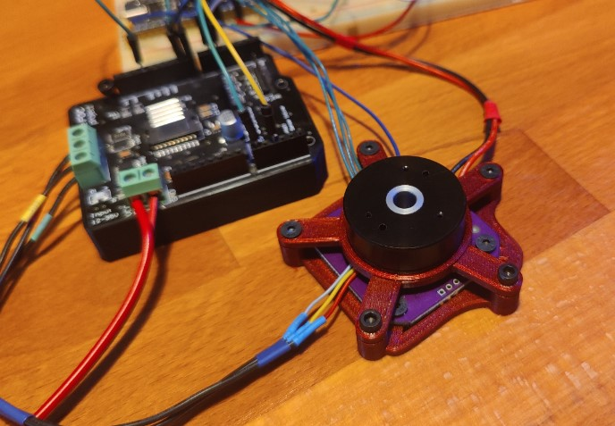

# MotorKnob - Firmware

A very simple haptic device. Inspired by [Scott Bezek's Smart Motor Knob](https://github.com/scottbez1/smartknob) and [Karlitos/Binaris](https://store.binaris.io).

It uses my fork of [haptic-bldc-lib by VIPQualityPost](https://github.com/VIPQualityPost/haptic-bldc-lib).  
It can be interfaced with using I2C.

## Hardware
This uses a [special gimbal motor](https://www.sparkfun.com/products/20441).  
And a simple MT6701 Encoder (the big ones).  
In combination with a [SimpleFocShield](https://docs.simplefoc.com/arduino_simplefoc_shield_showcase).  
Everything running on a STM32F4.  

_STLs_ for a simple mount are included.  
Also checkout the Onshape Document for the [Motor Mount](https://cad.onshape.com/documents/7e04387006899651ea17d00d/w/a87f37efcacd94681ec261e1/e/0a7188be34b13700e3c3eeff) and the very basic [Shield Holder](https://cad.onshape.com/documents/3ccac3d901ce4e169d3a0e37/w/05fb2bf43415ca03ddd7f8aa/e/4bedb51f26a17385ea4008f9), feel free to adapt them to your needs.

## Driver
There is also a compatible [Linux Driver](https://github.com/Lukas-Sturm/MotorKnob-Driver) plus [Yocto Layer](https://github.com/Lukas-Sturm/meta-motorknob) available.  
Plus [Demo Application](https://github.com/Lukas-Sturm/MotorKnob-Demo) using it.

## Protocol
`communication.h` contains all the i2c/SMBus logic.  
I used a form of SMBus, it basically reads and writes words (2 bytes) per command, because this is supposed to interact with Linux a Driver.  

#### Reads
_First Byte_: Address Register   
_Second Byte_: Lower Data Byte  
_Third Byte_:  Upper Data Byte  

> adheres to SMBus standard for reading a word

#### Writes  
needs the address MSB set to 1  
position can't be written  

_e.g_:  
0b10000001 (0x81) __writes__ _end position_  
0x81 0x10 0x00 -> Sets __end position__ to 16.

> adheres to SMBus standard for writing (except the extra write bit)

### Registers
- `0x00` start position
- `0x01` end position
- `0x02` detent count
- `0x03` position

Bit 8 is reserved and indicates a Write command.

### Why not i2c read/write bit?
SMBus protocol always starts by sending a write with the register it wants to read/write. Then it either sends more data or sends a empty read package. That's why I need to set a write bit in the initial write command for the address. ¯\\_(ツ)_/¯ atleast that's how I got it running communicationg with Linux host.

## Notes
- This is very basic
- Currentsense is disabled (just stopped working with my setup)